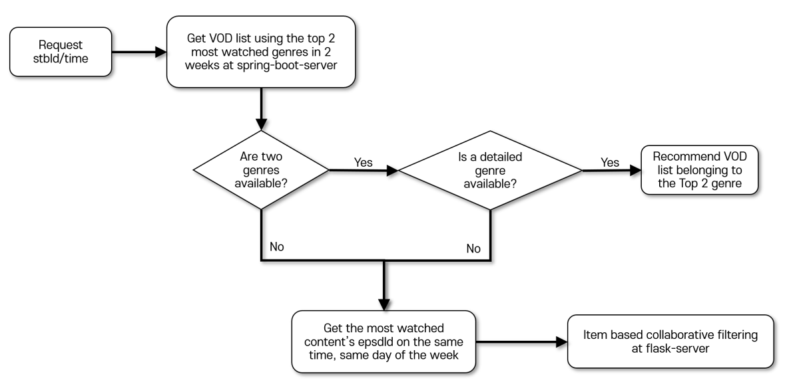

# real-time-recommend

실시간 추천 서비스


- project flow

  




## Table of Contents

- Examples
- Prerequisites
- Install
  - flask-server
  - spring-boot-server
  - database
- Rest API


## Examples


## Prerequisites

- Python > 3.6
- Java 11


## Install

### flask-server 

#### Base URL : http://54.180.30.116/5000

```python
pip install flask
pip install flask_restful
pip install pandas
pip install sklearn
```


### spring-boot-server

#### Base URL : http://54.180.30.116/8080

The main project is a [Spring Boot](https://spring.io/guides/gs/spring-boot) application built using [Maven](https://spring.io/guides/gs/maven/).

```java
mvn compile
```

Plugin for [IntelliJ IDEA](http://plugins.jetbrains.com/plugin/6317-lombok-plugin) to support [Lombok](https://projectlombok.org/) annotations.


### Database

Install MySQL

```yml
## application.yml
url: jdbc:mysql://db-1.cx9greozla0d.ap-northeast-2.rds.amazonaws.com:3306
```

```mysql
create database btvdb;
```


## Rest API

| METHOD | PATH                   | DESCRIPTION                                                 |
| ------ | ---------------------- | ----------------------------------------------------------- |
| GET    | /log                   | Get all log data from database                              |
| GET    | /genre/{stbId}/{now}   | Get top 2 most watched genres at the same time for 2 weeks  |
| GET    | /content/{stbId}/{now} | Get the most watched contentId at the same time for 2 weeks |
| GET    | /epsdids/{contentId}   | Find epsdId list corresponding to contentId                 |
| GET    | /epsd/{stbId}/{now}    | Get epsdId list of VOD recommendation                       |